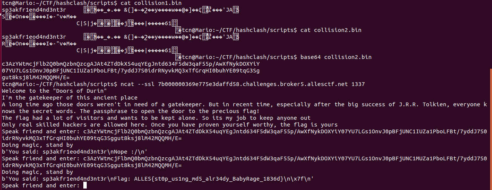

# Doors of Durin (124 pt - 47 solves)

Category: Crypto
Difficulty: Easy
Author: 0x4d5a
First Blood: b00tplug

Can you pass the guard who watches over the Doors of Durin?

Challenge Files: [door.c](door.c) [gatekeeper.py](gatekeeper.py)

## Tools needed
- unicoll/hashclash - [https://github.com/cr-marcstevens/hashclash)

## Solution

We need to bypass 2 validations:
- [gatekeeper.py](gatekeeper.py): makes sure the input does not contain `sp3akfr1end4nd3nt3r`, or matches a preentered 'good hash'
- [door.c](door.c): accepts `sp3akfr1end4nd3nt3r` as the magic word, or any input that starts with `sp3akfr1end4nd3nt3r + null byte`

The hash is a combination of `md5`, `sha1`, `sha384`, `blake2b`. We know that `md5` has been considered weak and there are many ways to create a hash collision, so this is the way to go.

[This page](https://github.com/corkami/collisions) gives a very good summary of hash collisions and exploitations. [Chosen-prefix collisions](https://github.com/corkami/collisions#chosen-prefix-collisions) with hashclash seems to be the right approach to solve this challenge, however it takes a lot of time (72 hours.core). Fortunately there's a better approach, using [identical prefix with unicoll](https://github.com/corkami/collisions#unicoll-md5).

To understand how this attack work, refer to the link given. Tldr version: from a prefix, unicoll generates 2 files, one with the given prefix, one with that prefix with a small difference at 9th character (perfect for us to bypass the gatekeeper check).

Command to run unicoll:

```
$ printf 'sp3akfr1end4nd3nt3r\x00' > prefix.txt
$ ./poc_no.sh prefix.txt
```

The script runs for a little over 1 hour on my old Core 2 Duo machine. It generates 2 files with the same md5: [collision1.bin](collision1.bin) and [collision2.bin](collision2.bin)


