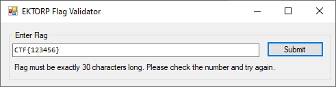
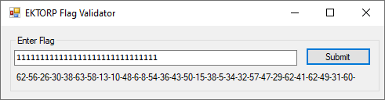
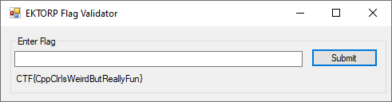

# .NET (225 pt)

.NET is great, especially because of all its weird features.

[Attachment](https://storage.googleapis.com/gctf-2020-attachments-project/a8d65cb3b53a09c557b4e9a1744e08f73d0571dba9d79241fed3519cdd38f14c51472b108353f033e3223b5ec48bb8f0296b2abc3142ea0690592b9904816d3b)

## Tools needed
- dnSpy - [https://github.com/0xd4d/dnSpy](https://github.com/0xd4d/dnSpy)
- z3 - [https://github.com/Z3Prover/z3](https://github.com/Z3Prover/z3)
- IDA or any other disassembler is not needed, this is a pure .Net (and z3) solution

## Solution

We are given a .Net application. The goal is to find a flag that passes the validation.

Playing around with the application we know that the flag must be exactly 30 characters long. Also, it must match a checksum before going through the final validation.



Inspecting the application with dnSpy, we find the validation function:

```c#
private void submit_button_Click(object sender, EventArgs e)
{
	string text = KVOT.FYRKANTIG(this.flag_textbox.Text);
	if (text != null)
	{
		this.information_label.Text = text;
	}
	else
	{
		this.information_label.Text = "Correct!";
	}
}
```

Looking closer inside the `FYRKANTIG` function:

```c#
private static string FYRKANTIG(string BISSING)
{
	List<uint> list = null;
	if (BISSING.Length != 30)
	{
		return "Flag must be exactly 30 characters long. Please check the number and try again.";
	}
	list = SOCKERBIT.GRUNDTAL_NORRVIKEN(BISSING);
	int num = 0;
	if (0 < list.Count)
	{
		while (list[num] <= 63U)
		{
			num++;
			if (num >= list.Count)
			{
				goto IL_5F;
			}
		}
		return "Unexpected character " + BISSING[num] + "; Characters must be in the set {A-Za-z0-9}. Please check the number and try again.";
	}
	IL_5F:
	FARGRIK.DAGSTORP(ref list, new List<uint>(30)
	{
		... // omitted for readability
	});
	if (!<Module>.SMORBOLL(list))
	{
		return "Flag checksum invalid. Please check the number and try again.";
	}
	return <Module>.HEROISK(list);
}
```

Summary of what this function does:
- Checks the flag length (30 characters)
- Calls the `GRUNDTAL_NORRVIKEN` function to create a list of unsigned integers from the flag (which is basically a translation of `0-9A-za-z{}` to `0-63`)
- Calls the `DAGSTORP` function to xor the list with another list of unsigned integers
- Calls the `SMORBOLL` function to calculate a checksum from the list and validate it
- Calls the `HEROISK` function to validate the list against a set of conditions

We recover the list (after xored) by putting all the conditions in `SMORBOLL` and `HEROISK` into z3 and let it find the solution: [solver.py](solver.py)

`48, 25, 23, 19, 15, 26, 13, 57, 36, 9, 52, 27, 4, 18, 49, 6, 41, 8, 43, 62, 45, 55, 37, 32, 1, 0, 7, 28, 47, 2`

After that we reverse the xor and the base64 conversion: [Solver.cs](Solver.cs). Sadly all that we get is: `YouMissedSomethingImportantCpp`. Inputting this "fake flag" into the application and we get "Flag checksum invalid". Something is really missing here.

Looking closer, the application is shipped together with `0Harmony.dll`. [A quick research](https://harmony.pardeike.net/) tells us this is a library that does all the magic - patch the functions in the application so that they do something else. This patching is done inside the `VARDAGEN` function:

```c#
internal static void VARDAGEN()
{
	Harmony harmony = new Harmony("fun");
	MethodInfo method = typeof(KVOT).GetMethod("FYRKANTIG", BindingFlags.Instance | BindingFlags.Static | BindingFlags.Public | BindingFlags.NonPublic);
	MethodInfo method2 = typeof(GATKAMOMILL).GetMethod("NUFFRA", BindingFlags.Instance | BindingFlags.Static | BindingFlags.Public | BindingFlags.NonPublic);
	harmony.Patch(method, new HarmonyMethod(method2), null, null, null);
	MethodInfo method3 = typeof(KVOT).GetMethod("RIKTIG_OGLA", BindingFlags.Instance | BindingFlags.Static | BindingFlags.Public | BindingFlags.NonPublic);
	MethodInfo method4 = typeof(GATKAMOMILL).GetMethod("GRONKULLA", BindingFlags.Instance | BindingFlags.Static | BindingFlags.Public | BindingFlags.NonPublic);
	harmony.Patch(method3, new HarmonyMethod(method4), null, null, null);
	MethodInfo method5 = typeof(SOCKERBIT).GetMethod("GRUNDTAL_NORRVIKEN", BindingFlags.Instance | BindingFlags.Static | BindingFlags.Public | BindingFlags.NonPublic);
	MethodInfo method6 = typeof(GATKAMOMILL).GetMethod("SPARSAM", BindingFlags.Instance | BindingFlags.Static | BindingFlags.Public | BindingFlags.NonPublic);
	harmony.Patch(method5, new HarmonyMethod(method6), null, null, null);
	MethodInfo method7 = typeof(FARGRIK).GetMethod("DAGSTORP", BindingFlags.Instance | BindingFlags.Static | BindingFlags.Public | BindingFlags.NonPublic);
	MethodInfo method8 = typeof(GATKAMOMILL).GetMethod("FLARDFULL", BindingFlags.Instance | BindingFlags.Static | BindingFlags.Public | BindingFlags.NonPublic);
	harmony.Patch(method7, new HarmonyMethod(method8), null, null, null);
}
```

[Here](https://harmony.pardeike.net/articles/patching-prefix.html) is an explanation of how Harmony patching works. A summary of what happen inside this function:
- `FYRKANTIG` is patched with `NUFFRA`, which calls an ugly native function (before the original `FYRKANTIG` function)
- `RIKTIG_OGLA` is patched with `GRONKULLA`, which calls another ugly native function (before the original `RIKTIG_OGLA` function that was doing nothing)
- `GRUNDTAL_NORRVIKEN` is patched with `SPARSAM`, which essentially returns false - to skip execution of the original function - base64 conversion
- `DAGSTORP` is patched with `FLARDFULL`, which essentially returns false - to skip execution of the original function - xoring with the uint list

Summary of flag validation after Harmony patching:
- Flag is converted to another string (ASCII values from 0 to 63 using some native functions
- Create a list of unsigned integers from the flag (no more base64 conversion)
- No more xoring
- Checksum and conditional validations are still the same in `SMORBOLL` and `HEROISK` functions

The native functions are ugly, so we try another way around. First we patch the `FYRKANTIG` function with dnSpy so it prints out the string after going through the native functions (result: [EKTORPFlagValidator_Patched1.exe](EKTORPFlagValidator_Patched1.exe))

```c#
private static string FYRKANTIG(string BISSING)
{
	List<uint> list = null;
	string text = "";
	if (BISSING.Length != 30)
	{
		return "Flag must be exactly 30 characters long. Please check the number and try again.";
	}
	list = SOCKERBIT.GRUNDTAL_NORRVIKEN(BISSING);
	int num = 0;
	if (0 < list.Count)
	{
		while (list[num] <= 63U)
		{
			text += list[num] + "-";
			num++;
			if (num >= list.Count)
			{
				goto IL_A8;
			}
		}
		return "Unexpected character " + BISSING[num].ToString() + "; Characters must be in the set {A-Za-z0-9}. Please check the number and try again.";
	}
	IL_A8:
	FARGRIK.DAGSTORP(ref list, new List<uint>(30)
	{
		... // omitted for readability
	});
	return "C! " + text;
}
```



Playing around with various inputs, we know that the native functions are not very complicated. A character in the input results in another character in the output (at a different position - some shuffling is involved).

With this knowledge, it is enough to recover the flag. The algorithm works as follow:
- For each position in the input, find its corresponding position in the output by testing 2 different values
- Bruteforce the characters in each position to find the matching output (recovered previously with z3)

This can be done manually but it is a bit tedious. We take it to another level by injecting the code inside the `submit_button_Click` function, so that when we click the submit button, the program prints out the flag. Cool huh ;)

(Patching code: [Patch.cs](Patch.cs) Result: [EKTORPFlagValidator_Patched_Final.exe](EKTORPFlagValidator_Patched_Final.exe))

```c#
// OSTRON.KVOT
// Token: 0x06000153 RID: 339
private void submit_button_Click(object sender, EventArgs e)
{
	int[] list = { 48,25,23,19,15,26,13,57,36,9,52,27,4,18,49,6,41,8,43,62,45,55,37,32,1,0,7,28,47,2 };
	string alpha = "0123456789abcdefghijklmnopqrstuvwxyzABCDEFGHIJKLMNOPQRSTUVWXYZ{}";
	string result = "";
	for (int i = 0; i < 30; i++)
	{
		int pos = this.FindShuffledPosition(i);
		foreach (char c in alpha)
		{
			string input = CreateInput(i, c);
			string[] output = KVOT.FYRKANTIG(input).Split('-');
			if (Convert.ToInt32(output[pos]) == list[pos])
			{
				result += c;
			}
		}
	}
	this.information_label.Text = result;
}
private string CreateInput(int pos, char c)
{
	string res = "";
	for (int i = 0; i < 30; i++)
	{
		if (i != pos)
		{
			res += "1";
		}
		else
		{
			res += c;
		}
	}
	return res;
}
private int FindShuffledPosition(int pos)
{
	string[] output = KVOT.FYRKANTIG(this.CreateInput(pos, '1')).Split('-');
	string[] output2 = KVOT.FYRKANTIG(this.CreateInput(pos, '2')).Split('-');
	for (int i = 0; i < 30; i++)
	{
		if (output[i] != output2[i])
		{
			return i;
		}
	}
	return -1;
}
```


