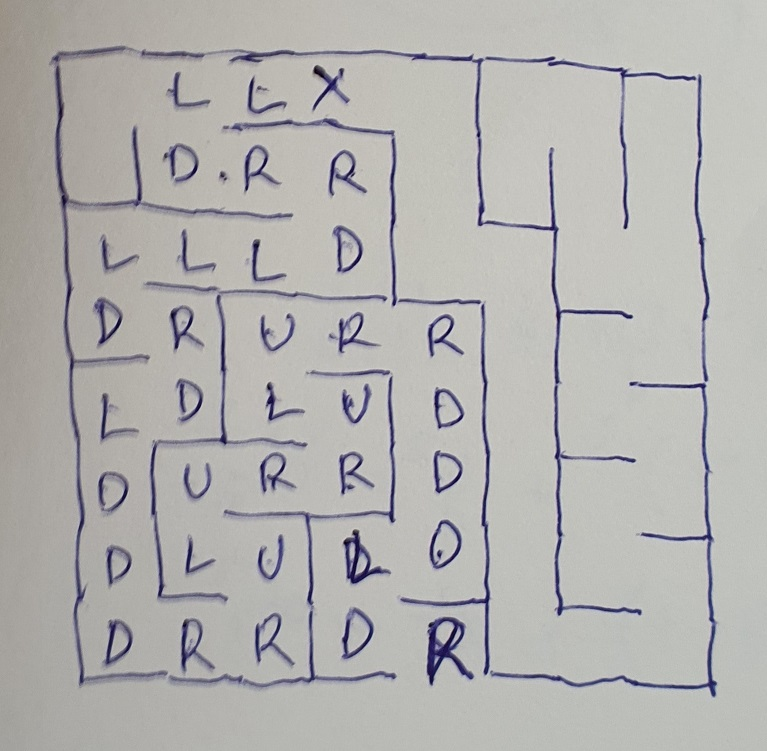

# maze (Reversing - 421 pts - first blood)

### Cooperation of reverser and cyberartist got us first blood. Hurray!

Opening the executable in IDA, we found the following [code](maze_pseudocode.c):

```c
int sub_4011B0()
{
  char x; // bl@1
  unsigned __int8 j; // dl@1
  signed int i; // esi@2
  char c; // al@3
  int len; // ecx@4
  unsigned int v5; // esi@19
  char flag[256]; // [sp+8h] [bp-230h]@1
  char input[256]; // [sp+108h] [bp-130h]@1
  int data; // [sp+208h] [bp-30h]@1
  int v10; // [sp+20Ch] [bp-2Ch]@1
  int v11; // [sp+210h] [bp-28h]@1
  int v12; // [sp+214h] [bp-24h]@1
  int v13; // [sp+218h] [bp-20h]@1
  int v14; // [sp+21Ch] [bp-1Ch]@1
  int v15; // [sp+220h] [bp-18h]@1
  int v16; // [sp+224h] [bp-14h]@1
  int v17; // [sp+228h] [bp-10h]@1
  int v18; // [sp+22Ch] [bp-Ch]@1
  int v19; // [sp+230h] [bp-8h]@1

  data = -1341248919;
  v10 = 1078449436;
  v11 = -404433706;
  v12 = 2107721006;
  v13 = 310654741;
  v14 = 466487083;
  v15 = 244438942;
  v16 = -1045521021;
  v17 = -1205263960;
  v18 = 136611182;
  v19 = 31438528;
  memset(flag, 0, 0x100u);
  memset(input, 0, 0x100u);
  printf_("Do you wanna play a game?\n");
  printf_("Let's play escape game where you have to find a way out. Please enter your way:");
  sub_401050("%s", input, 256);
  x = 3;
  j = 0;
  if ( strlen(input) != 34 )
    goto _Failed;
  i = 0;
  do
  {
    c = input[i];
    switch ( c )
    {
      case 'U':
        len = j;
        if ( byte_404018[4 * (x + 8 * j)] != 1 )
          goto _Failed;
        --j;
        break;
      case 'D':
        len = j;
        if ( byte_404019[4 * (x + 8 * j)] != 1 )
          goto _Failed;
        ++j;
        break;
      case 'L':
        len = j;
        if ( byte_40401A[4 * (x + 8 * j)] != 1 )
          goto _Failed;
        --x;
        break;
      default:
        if ( c != 'R' )
          goto _Failed;
        len = j;
        if ( byte_40401B[4 * (x + 8 * j)] != 1 )
          goto _Failed;
        ++x;
        break;
    }
    ++i;
  }
  while ( i < 34 );
  if ( x != 4 || j != 7 )
  {
_Failed:
    printf_("You're stuck!\n");
    return 0;
  }
  if ( decrypt((int)flag, (int)&data, len, (int)input) == -1 )
    return 0;
  printf_("Escaped! You see the flag\n");
  v5 = 0;
  do
  {
    Sleep(0xC8u);
    printf_("%c", flag[v5++]);
  }
  while ( v5 <= 44 );
  return 0;
}
```

Here's how it works:
- You are expected to escape from a maze. Starting from (3, 0). Exit is at (4, 7)
- Maze is of size 8x8
- Available moves are: U (Up), D (Down), L (Left), R (Right)
- Each cell in the maze is represented by 4 bytes corresponding to the 4 sides. 1 means you can move in that direction. 0 means there is a wall, you cannot move.
- You are given a maximum of 34 moves. The string is then used to decrypt the flag.

We dumped the maze data (offset 0x404018):

```
00 01 00 01 00 01 01 01 00 00 01 01 01 00 01 01
00 01 01 00 00 01 00 01 00 01 01 00 00 01 00 00
01 00 00 00 01 00 00 01 00 00 01 01 00 01 01 00
01 01 00 00 01 00 00 00 01 01 00 00 01 01 00 00
00 01 00 01 00 00 01 01 00 00 01 01 01 00 01 00
01 00 00 01 00 01 01 00 01 00 00 01 01 01 01 00
01 00 00 01 00 01 01 00 00 01 00 01 00 00 01 01
00 01 01 00 01 01 00 00 00 01 00 01 01 00 01 00
00 01 00 01 01 00 01 00 01 00 00 01 00 01 01 00
01 01 00 00 01 01 00 00 01 00 00 01 00 01 01 00
01 01 00 00 00 01 00 01 00 00 01 01 01 00 01 00
01 01 00 00 01 01 00 00 00 01 00 01 01 00 01 00
01 01 00 00 01 00 00 01 00 01 01 00 00 01 00 01
01 00 01 00 01 01 00 00 01 00 00 01 00 01 01 00
01 00 00 01 00 00 01 01 01 00 01 00 01 00 00 01
00 01 01 00 01 00 00 01 00 00 01 01 01 00 01 00
```

Then drew it in human-understandable format (with a pen and paper, because the maze is small enough :P):



Now the solution is clear:

```
Do you wanna play a game?
Let's play escape game where you have to find a way out. Please enter your way:LLDRRDLLLDRDLDDDRRULURRULURRDDDLDR
Escaped! You see the flag
flag{FLa9_I5_w41tIN9_foR_YoU_A7_th3_w@y_ouT}
```
