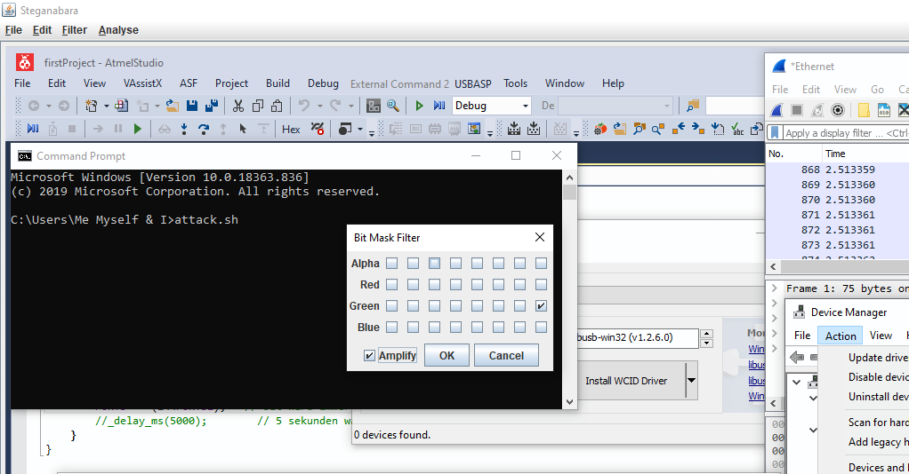
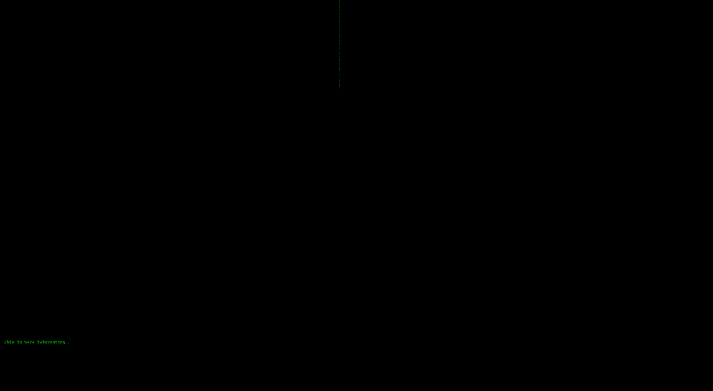

There is information hiding in the green channel LSB.

Using [Steganabara](https://github.com/quangntenemy/Steganabara)'s Bit Mask Filter to extract it we see the text "This is more interesting" and some binary-encoded pixels.





[Extract the pixels, change it to black/white](Screenshot_2020-05-19_at_11.38.08_AM_G0_XT.png) and use [dcode's binary image](https://www.dcode.fr/binary-image) to extract the flag.

```
011100110111100101110011011010110111001001101111011011100100001101010100010001100111101101110011001100110110001101110010001100110101010001011111011011010011001101110011010100110011010001100111001100110111110100
```

Flag: `syskronCTF{s3cr3T_m3sS4g3}`
