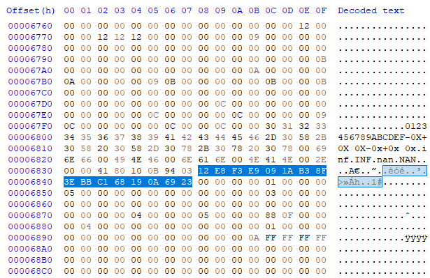

The first part is the same as nookstop 1.0, so we run `$("#flag").click()` in Chrome developer console and advance to the next step:

```
Grabbing your banking information......
Your routing number is: 0x9a0 2464
Your account number has been successfully transmitted using the latest XOR encryption, and is not shown here for security reasons.
Please stand by while the ABD decrypts it.......

Calling decrypt function....
  wkwcwg{c3oo33os
Uh-oh! There's been an error!
```

There's an error with the decryption function, the flag cannot be decrypted properly. Looking at the Network tab in Chrome developer console we can see that:

- Encrypted flag is at [https://nookstop2.chal.uiuc.tf/a9bc27ff-0b0c-494d-9377-14c95ca94b67/flag](flag)
- The decrypt function is in [https://nookstop2.chal.uiuc.tf/a9bc27ff-0b0c-494d-9377-14c95ca94b67/index.wasm](index.wasm)

We know that XOR is used here, so let's try xoring the flag with `uiuctf` prefix to find a part of the key (and hope the algo is that simple :P):

```
67 81 86 8A 7D 7C
75 69 75 63 74 66
-----------------
12 E8 F3 E9 09 1A
```

Now we try to recover the full key from `index.wasm`. Using a hex editor, it's found at offset 26680 (0x6838): `12 E8 F3 E9 09 1A B3 8F 3E BB C1 68 19 0A 69 23`



```
67 81 86 8A 7D 7C C8 ED 0F D7 AD 59 29 64 1A 5E
12 E8 F3 E9 09 1A B3 8F 3E BB C1 68 19 0A 69 23
-----------------------------------------------
75 69 75 63 74 66 7b 62 31 6c 6c 31 30 6e 73 7d
```

Flag: `uiuctf{b1ll10ns}`