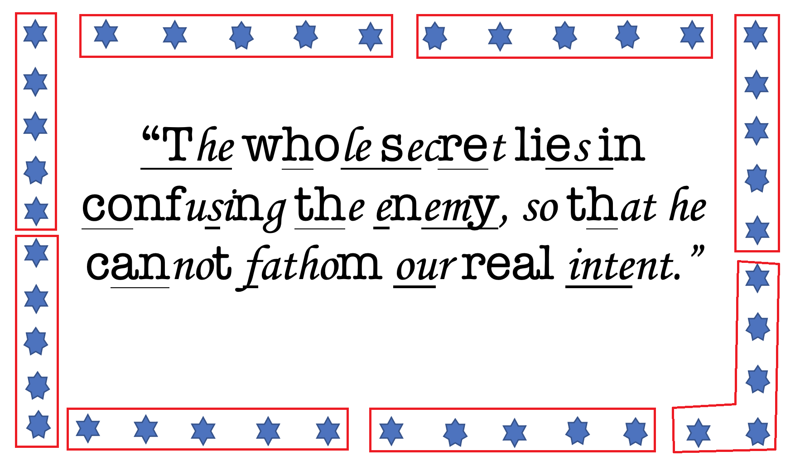

# Rise and Shine (warm-up misc crypto - 354 pts)

Once upon a time, in a land not too far away, and not as distant as you might think in time, as well, there was a little penguin 🐧. And, that penguin went to `/etc/secret` in Deutschland wearing his little red riding hood, there he met the bad black horned creature and his (maybe bad) friends.

Bad black horned creature and his friends told the little penguin that they are actually good, M$ is the evil one.

(Maybe) good black horned creature and his friends taught little penguin to treasure what he had, especially his smileys.

Good black horned creature and his friends helped little penguin realize that XOR is reversible, and RSA is not the solution to all problems.

Little penguin made a lot of friends, one of them was very talented at hiding stuff inside other stuff, which people call the art of steganography. Little penguin had fun solving those steganography challs, his observation and analysis skills greatly improved. He even created a [tool which helps with steganalysis](https://github.com/quangntenemy/Steganabara).

Many years have passed, little penguin had grown up to become big penguin. Although busy catching fish and taking care of his kids, big penguin still spent some of his free time catching the flags to relive great moments of the good old days.

One day big penguin found a strange bottle drifting from the land of the blue hens to his island. Actually, many other penguins saw that bottle and tried to read its content, but all they found was gibberish. Here was what the bottle looked like:


To the big penguin, however, the bottle was like a message from the good old days. He easily figured out the important part, as portrayed below:



Big penguin started reading the bottle counterclockwised, interpreting each hexagram as 0, and heptagram as 1:

```
00010 00111 00000 01011 01110 01000 01101 01100
```

Breakfast is the most important meal of the day, and big penguin really liked bacon for breakfast. He also used the bacon to decrypt the message and recovered the hidden message:

`UDCTF{CHAMPION}`

---
# hot_diggity_dog (crypto - 50 pts)

Challenge file: [hot_diggity_dog.py](hot_diggity_dog/hot_diggity_dog.py)

We have very big `e`, which usually means small `d`. That means we can use [Wiener's attack](https://en.wikipedia.org/wiki/Wiener%27s_attack) to recover the private key and break the encryption.

[hot_diggity_dog_sol.py](hot_diggity_dog/hot_diggity_dog_sol.py)
```python
from Crypto.Util.number import *
import owiener

e = 533...175
n = 235...477
d = owiener.attack(e, n)

if d is None:
    print("Failed")
else:
    print("Hacked d={}".format(d))

c = 144...955
pt = pow(c, d, n)
print(long_to_bytes(pt).decode())
```

Flag: `UDCTF{5t1ck_t0_65537}`

---
# PHEnomenal (crypto - 212 pts)

This is [Paillier cryptosystem](https://en.wikipedia.org/wiki/Paillier_cryptosystem). The Wikipedia article explains how to solve it.

[phe_sol.py](PHEnomenal/phe_sol.py)
```
$ nc challenges.ctfd.io 30004
HEllo Pascal!

Can you hold on to this for me? 7045001712129290104740453771823045106952481546330404928713847721848183810696145517097268196377976099275055495039707971129931107449982416568160948497928248463143492080838528598140305135174841179983634562448037950650047866858220559728381303123621058488898148320957290407642439892837620410847723505358236000237581385801852438127447375629370664419984126913461089677932354081765872357047341149433992523780170315887610881861157754107023846183105216747579529847536607911303093257620473805704701707543244011078747468073224186989220608579205672000750125614972191202858262844787749704918523968839007724218464537679639536523427386031513104794690662071513900785727010820920011051096504190662447217945998616882895023930453713191048885677465219561536421329820218501388047526906508561538697327469199445732862934574867790736026507428590244774777926449960505346573835200898704104194442381672389731164802803900591305996766742167340729429501856611027413590950276190054155986076043085609239656032757504162526783623441080962631146789236406198442011064598469203807405083581577145775842772103360115749801495201867387983046876232240024280370477404933854203732927991855847169298286545662978092705132211290967461780971805425300244308378752382008661326160548930300082548054167007147564074200499398291052091135952214759174423238347213937389956334074027617659698480589503960758035129260880222878778209300061210211197800501030944323996399040015284532855665296627995848879722996300072697799118410628989640238176294443198532927358049368206797584405424489342952174055312517623271731626556510387157140553166397769249682558168456198305801387842178467000913944643674959724681747581275966517185867897188139693603084270726957926463158738719153861044878828587522672830804821235559152892229784540476572454745978534520174295700566529887348046619996620625513302432782874678950259532299895001

I want to keep it somewhere safe. It's an encryption of my lucky number 91 !

Oh, I think you may need N^2 as well: 11426496776285178936570459406381262387517175431794873272956806459596070337052022654703272284945700516245335238328740140879745621189606268957947012369273749950525197624754671239212555794243568231646071312422835019209004525595040291011159376198122314847969367154919066944272469529842667179471375768345334167805463773444832826445651863067408150197807982863190099321318370965956373486458856025442737704411866086729114483267719592024260405239900924723780649470118101588333557255099427601416779474968138696319041371002457872419122044036329532716855380943632847366735565683473953847760909174469987947910776511294999392071224227832559210606234202989530271331623642793371147864917578190372432326684504276870131173864280596078981440436728406601075521502878655934042031234036087160135363421146133724700025373149289064536225273914002065849952591838991968094633979077469924260859701593751950590149906507849445892860089244826761459139160286863826739732138282471373439087078176923086907051698652624811184394976375272295551824231837507202498694511951474314820942264835527007365703423165465867517130899022137429038347112726790023838305492360786911394786790303804091202937960225775781476388426892760865911375097511158938408139307386747640260724736408764690225639534302442236620591277091539724734470736939353350125715134858607175427038718089383002890201612669742884344830232791960739232959289202188400439478555568285949127239006020408635197977523328135534098438584956183880173073588161024286552384667744350839266313914954447170772444533945885081793803317253502491171676738353041164822627500793324719514129929827231988224792256121172254874817541395708180769726267726363434097388865253350720912092785820506837210704889550709208972556621345652763490975317012672490780720528163685376527679897354805791955897471116347406015950216326759384521667812452634710617214801519102209

Uh oh, I need some help! Can you give me the encryption of 76622? 6103829929852336164433100253495406233334092781473395566370942436860677269345408757254947386208917701882865141989471117315760015446316684498777294992632602775725804044916259522812823718480389289462189401113230073653462029313599113937224485137868691732789572824172203706726349230010529497118394147101410144374191053676983237219635638115267368415605245924782586900020042429187568593064900228050585148561933971837158502631434304707866182683943287963574204745532484194123474610983094463682597855757923242701977258957180189617322238339588405127982777250193879512374250230107235856477711873597855880399504121088749794574453619625447192757273857636782544463923778949070931552789656622832612829313547915615899484719380955164809195481524663823155798080478319268184859338823018648511786737768215757101383919679488681488307985805520201774856041761112607386526061947057739235736735100547006773096649332708529829011106127963626046678447856193440092084444184894846796574736595053100024783622080654493251397493557463861550798344235251655415364146821739454776388540832500881051105511640202947717089598611748191309213306098097716486910245753311649874096886456066715017500881450744353330594174964674367415353348550982913790363216710856726431400861384122776715213521715645250468778489889750755131029472438517211448865614158912927277778197219022574271754990751074940629064760543119581289593067479882547575155398843084047174305355878137308494989988574945006675935880577666242537000895023593733413614804900736957625170578438324664272573456515935825499282445716130389605642347922841980276160896444558075174081683648653040538598325184965439621958030351666748156083865292945644836550367522724535603713682358785629860660057162354214448617166463540940297347670767922050303365612899757157704219068377981497489346884478383732658404959934336165156888273885019406908728892038145122

UDCTF{P41ll13R_one_oh_one}
```

---
# OTP1 (crypto - 284 pts)

Challenge file: [otp1.php](OTP1/otp1.php)

This is XOR cipher with the flag as repeated key.
```php
//For these problems I'll only change these 2 lines:
$flag = trim(file_get_contents("../../flag1.txt"));
$key = pad_string($flag, 0); 
```

We use [CyberChef](https://gchq.github.io/CyberChef/) to dump ciphertext to file, then [xortool](https://github.com/hellman/xortool) to find the key length of 25 and try to reveal some part of the flag.
```
$ xortool otp1.dat
The most probable key lengths:
 2:   9.6%
 5:  15.6%
10:  13.0%
13:   7.7%
15:  10.3%
20:   8.6%
22:   6.1%
25:  15.4%
30:   6.1%
50:   7.6%
Key-length can be 5*n
Most possible char is needed to guess the key!
$ xortool -l 25 -c 'E' otp1.dat
4 possible key(s) of length 25:
UDCTFjw?}r!mtNe0N<brUgefl
UDCTFjw?}r!mtNe0U<brUgefl
UDCTFjw?lr!mtNe0N<brUgefl
UDCTFjw?lr!mtNe0U<brUgefl
Found 4 plaintexts with 95%+ valid characters
See files filename-key.csv, filename-char_used-perc_valid.csv
```

Then use [otp_pwn](https://github.com/derbenoo/otp_pwn) to decrypt the text.

```
POS   | HEX | DEC | STR |   POS   | HEX | DEC | STR |   POS   | HEX | DEC | STR |   POS   | HEX | DEC | STR |   POS   | HEX | DEC | STR |   POS   | HEX | DEC | STR |   POS   | HEX | DEC | STR |
-------------------------   -------------------------   -------------------------   -------------------------   -------------------------   -------------------------   -------------------------
    0 | 54  |  84 |  T  |      25 | 50  |  80 |  P  |      50 | 4f  |  79 |  O  |      75 | 4e  |  78 |  N  |     100 | 53  |  83 |  S  |     125 | 52  |  82 |  R  |     150 | 53  |  83 |  S  |
    1 | 48  |  72 |  H  |      26 | 52  |  82 |  R  |      51 | 53  |  83 |  S  |      76 | 43  |  67 |  C  |     101 | 45  |  69 |  E  |     126 | 55  |  85 |  U  |     151 | 54  |  84 |  T  |
    2 | 55  |  85 |  U  |      27 | 45  |  69 |  E  |      52 | 54  |  84 |  T  |      77 | 4f  |  79 |  O  |     102 | 56  |  86 |  V  |     127 | 4d  |  77 |  M  |     152 | 4f  |  79 |  O  |
    3 | 53  |  83 |  S  |      28 | 53  |  83 |  S  |      53 | 45  |  69 |  E  |      78 | 4e  |  78 |  N  |     103 | 45  |  69 |  E  |     128 | 50  |  80 |  P  |     153 | 4e  |  78 |  N  |
    4 | 43  |  67 |  C  |      29 | 53  |  83 |  S  |      54 | 58  |  88 |  X  |      79 | 53  |  83 |  S  |     104 | 52  |  82 |  R  |     129 | 45  |  69 |  E  |     154 | 49  |  73 |  I  |
    5 | 41  |  65 |  A  |      30 | 49  |  73 |  I  |      55 | 54  |  84 |  T  |      80 | 54  |  84 |  T  |     105 | 59  |  89 |  Y  |     130 | 54  |  84 |  T  |     155 | 53  |  83 |  S  |
    6 | 53  |  83 |  S  |      31 | 4f  |  79 |  O  |      56 | 52  |  82 |  R  |      81 | 41  |  65 |  A  |     106 | 44  |  68 |  D  |     131 | 46  |  70 |  F  |     156 | 48  |  72 |  H  |
    7 | 45  |  69 |  E  |      32 | 4e  |  78 |  N  |      57 | 41  |  65 |  A  |      82 | 4e  |  78 |  N  |     107 | 41  |  65 |  A  |     132 | 4f  |  79 |  O  |     157 | 4d  |  77 |  M  |
    8 | 53  |  83 |  S  |      33 | 41  |  65 |  A  |      58 | 56  |  86 |  V  |      83 | 54  |  84 |  T  |     108 | 59  |  89 |  Y  |     133 | 52  |  82 |  R  |     158 | 45  |  69 |  E  |
    9 | 4f  |  79 |  O  |      34 | 4e  |  78 |  N  |      59 | 41  |  65 |  A  |      84 | 4f  |  79 |  O  |     109 | 49  |  73 |  I  |     134 | 54  |  84 |  T  |     159 | 4e  |  78 |  N  |
   10 | 46  |  70 |  F  |      35 | 44  |  68 |  D  |      60 | 47  |  71 |  G  |      85 | 43  |  67 |  C  |     110 | 54  |  84 |  T  |     135 | 48  |  72 |  H  |     160 | 54  |  84 |  T  |
   11 | 49  |  73 |  I  |      36 | 54  |  84 |  T  |      61 | 41  |  65 |  A  |      86 | 43  |  67 |  C  |     111 | 49  |  73 |  I  |     136 | 4d  |  77 |  M  |     161 | 41  |  65 |  A  |
   12 | 4e  |  78 |  N  |      37 | 59  |  89 |  Y  |      62 | 4e  |  78 |  N  |      87 | 55  |  85 |  U  |     112 | 53  |  83 |  S  |     137 | 55  |  85 |  U  |     162 | 54  |  84 |  T  |
   13 | 4a  |  74 |  J  |      38 | 52  |  82 |  R  |      63 | 54  |  84 |  T  |      88 | 52  |  82 |  R  |     113 | 54  |  84 |  T  |     138 | 43  |  67 |  C  |     163 | 54  |  84 |  T  |
   14 | 55  |  85 |  U  |      39 | 41  |  65 |  A  |      64 | 42  |  66 |  B  |      89 | 52  |  82 |  R  |     114 | 48  |  72 |  H  |     139 | 48  |  72 |  H  |     164 | 48  |  72 |  H  |
   15 | 53  |  83 |  S  |      40 | 4e  |  78 |  N  |      65 | 49  |  73 |  I  |      90 | 45  |  69 |  E  |     115 | 45  |  69 |  E  |     140 | 57  |  87 |  W  |     165 | 45  |  69 |  E  |
   16 | 54  |  84 |  T  |      41 | 4e  |  78 |  N  |      66 | 47  |  71 |  G  |      91 | 4e  |  78 |  N  |     116 | 43  |  67 |  C  |     141 | 4f  |  79 |  O  |     166 | 43  |  67 |  C  |
   17 | 49  |  73 |  I  |      42 | 59  |  89 |  Y  |      67 | 4f  |  79 |  O  |      92 | 43  |  67 |  C  |     117 | 55  |  85 |  U  |     142 | 4e  |  78 |  N  |     167 | 48  |  72 |  H  |
   18 | 43  |  67 |  C  |      43 | 41  |  65 |  A  |      68 | 54  |  84 |  T  |      93 | 45  |  69 |  E  |     118 | 53  |  83 |  S  |     143 | 44  |  68 |  D  |     168 | 49  |  73 |  I  |
   19 | 45  |  69 |  E  |      44 | 4e  |  78 |  N  |      69 | 52  |  82 |  R  |      94 | 41  |  65 |  A  |     119 | 54  |  84 |  T  |     144 | 45  |  69 |  E  |     169 | 45  |  69 |  E  |
   20 | 41  |  65 |  A  |      45 | 44  |  68 |  D  |      70 | 59  |  89 |  Y  |      95 | 4d  |  77 |  M  |     120 | 4f  |  79 |  O  |     145 | 52  |  82 |  R  |     170 | 46  |  70 |  F  |
   21 | 4e  |  78 |  N  |      46 | 54  |  84 |  T  |      71 | 41  |  65 |  A  |      96 | 4f  |  79 |  O  |     121 | 4d  |  77 |  M  |     146 | 41  |  65 |  A  |     171 | 41  |  65 |  A  |
   22 | 44  |  68 |  D  |      47 | 48  |  72 |  H  |      72 | 52  |  82 |  R  |      97 | 4e  |  78 |  N  |     122 | 54  |  84 |  T  |     147 | 4e  |  78 |  N  |     172 | 43  |  67 |  C  |
   23 | 4f  |  79 |  O  |      48 | 45  |  69 |  E  |      73 | 45  |  69 |  E  |      98 | 47  |  71 |  G  |     123 | 4f  |  79 |  O  |     148 | 44  |  68 |  D  |     173 | 54  |  84 |  T  |
   24 | 50  |  80 |  P  |      49 | 4d  |  77 |  M  |      74 | 49  |  73 |  I  |      99 | 55  |  85 |  U  |     124 | 54  |  84 |  T  |     149 | 41  |  65 |  A  |     174 | 4f  |  79 |  O  |
                                                                                                                                                                                                 
KEY: 55 44 43 54 46 7b 77 33 6c 63 30 6d 65 5f 74 30 5f 30 75 72 5f 63 74 66 7d
```

Flag: `UDCTF{w3lc0me_t0_0ur_ctf}`

---
# OTP2 (crypto - 422 pts)

Challenge file: [otp2.php](OTP2/otp2.php)

This time the flag is padded to a fixed length of 128 with random chars (both leading and trailing).
```php
//For these 3 problems I'll only change these 2 lines:
$flag = trim(file_get_contents("../../flag2.txt"));
$key = pad_string($flag, 128);
```

We know the flag format, also the plaintext consists of only uppercase characters, so let's write a script to find the position of the flag in the key
```python
from Crypto.Util.number import *
from string import ascii_uppercase

KLEN = 128
key = b'UDCTF{'
ct = [0xde1aaff3510601061a092e2a7b307e3e23100f643a1e27203a763c22763a1a35783a38a73de82037856d0e68a62d5fd23cc78e88c4c88ef8a307cd96d8d26d461ab0d4fa35c675befe312308972f1f1e7d0b9f536f5ba7c1ea43f5eebfb7a3ac756e4efd9053fd0b42df31c56cc175cd5c26afbfbc116a31b5d80c7c869a1617df12acef59061d0c01092924642b643929171966370b3b3b27742633763c192f652429b137e8202f9f781d6bbc3b4ec82bc78a95c0d490e2be1dc48ed4d9765b0db0cafa30dc63adf6272412942f1906640b9a4c7c52b4d0e45ae5e7b2b0b8ab767d5bfe9c52f5005fd020c063db75c45d35bda6ac0f6621b9cc1e789b9a100cd91aa0e8411d051511023423762d65212210167f26173a3a35702129633a1624622338a42bf5242e95630868bf2856d52eda8689c9cf99e8a41bce97d4d966521ba1cbeb31d464b5eb3738168c34131962058153665bbec1e346efe3a7b1b0ab76654af49c45fe175ed132dd6cc166ca5c35aca6ab0a6e38b1d20776899d1502c21caaed561c170e1b1233286137702c3e0c1075301a3f3d37652b34763b17277b313cbf37ef3b2891641363a73b42dc37ca9980d7df8ee2a21dc294c8d361461aa5d9fc3cd470ade8352b158e261d046416885e6f43b3cbf95bfbffaeb1a4a5727d5bee9152e80559da36c660d775cd5a3fada8bb0c7720a7c8057e9c9b180fde0fbbe65d1c0a041b083e22753079302016167f20093a2626662b34602016257f2038b337f4262f97680d72a22852ce31db8689c9c797e8a21ac596d4d1674701adddf627c168a9fc302f0797371e14790d8e566a54, 0xce1eb6ea5701050b01083f3f76206130220f14753b11273c33672c26633c13237c3938a03ef53b2c9e6a0873a33f4edd30da888dd1c991fab80ac595c9d66a4606a4cafa30da66b8f32723088028181e6300884d6a4eb0d6ee45ede6a5a1a5b07e654af49c41f20744d137d07ada78d15b34b3bbbc096d3db4d80f73879a1102db1da3ec4d1b001111022b287c347d303a1a0a752617363637673a22652e1034633f38b039f3273484671374b83458cf37ce8383c4c28cf7b51dc69fd3d665410da5ccf020dd69bff32d3f148c2902056f078c4a785fbad6e64af0e6b2b7b6ad736551fe9653e20d5ecd2dc67fc664d35623a1a7bc14633aaec9037486891d0ac40fabea5b0105011b132f246726642139171d7d3d0a213a37613d28713c1723643b3cbe36ee213a9a671166a03f5fd232c38e90c2ce82e3a41bce88d8c46c5c1fb4d9ec33da6fa8fd2d380f8f2b1002660f8c4c675ba0c3e346ece6b5a9b8b77f6e4cef984ee81758db27cc61db64d35622abbab1026e32b6d504689a9d1e0cd81faee54d120c06020329347e2b633b24110d74310a21313370262667290c31762430b633f32729936a187ead3545cf26df8790d6c086fbb501df92d8d674561aa1dffa39d46ea8f42c3e0a8a2c1319780b985d675fb4caef4be3e1a1a1a5ad786951f88054fa0a43ce2ac061d36dcc5534a7b0bd066326a3d50a699b80160dc41eacf75d010c0a1a01282572346130231d0d64251a313b30663e32793f1a2a743830b22ce83c2f9e781d75ae3458cf2fc09f90c9c791e7a500df98cfd2634700a9d6f83dc66eb8f72b3c0f8d20]
ct = [long_to_bytes(x) for x in ct]

def xor(data, key):
    out = []
    for k in range(0, len(data), len(key)):
        block = data[k : k + len(key)]
        out.append(bytes([a ^ b for a, b in zip(block, key)]))
    return b''.join(out)

def isupper(b):
    return all(x in ascii_uppercase.encode() for x in b)

def try_decrypt(ct, key):
    for i in range(0, len(ct), KLEN):
        pt = xor(ct[i:i+len(key)], key)
        print(str(i) + '-' + pt.decode(), end=' ')
    print()

def try_kpos(ct, pos, key):
    res = ''
    for i in range(pos, len(ct), KLEN):
        pt = xor(ct[i:i+len(key)], key)
        #print(pt)
        if not isupper(pt):
            return False, None
        res += pt.decode() + ' '
    return True, res

def find_kpos():
    for i in range(KLEN - len(key)):
        res = [try_kpos(x, i, key) for x in ct]
        if res[0][0] and res[1][0]:
            print(i, res[0][1], res[1][1])

find_kpos()
```

Output:
```
5 SEENOU SYOUOR HAVEDO ISMOTH INGONE  TAHUND NDREDP TABOUT GHEVER THINGS 
```

Now we try to figure out the next char
```python
def possible_chars(key, kpos):
    ch = ct[0][kpos]
    res = []
    for c in ascii_uppercase:
        res.append(ch ^ ord(c))
    return res

def find_nextchar(key, kpos):
    pchars = possible_chars(key, kpos + len(key))
    print(pchars)
    for c in pchars:
        res = [try_kpos(x, kpos, key + bytes([c])) for x in ct]
        if res[0][0] and res[1][0]:
            print(chr(c), res[0][1], res[1][1])

find_nextchar(key, 5)
```

Output:
```
[107, 104, 105, 110, 111, 108, 109, 98, 99, 96, 97, 102, 103, 100, 101, 122, 123, 120, 121, 126, 127, 124, 125, 114, 115, 112]
n SEENOUD SYOUORJ HAVEDOM ISMOTHF INGONEL  TAHUNDQ NDREDPF TABOUTJ GHEVERZ THINGSK 
l SEENOUF SYOUORH HAVEDOO ISMOTHD INGONEN  TAHUNDS NDREDPD TABOUTH GHEVERX THINGSI 
m SEENOUG SYOUORI HAVEDON ISMOTHE INGONEO  TAHUNDR NDREDPE TABOUTI GHEVERY THINGSH 
f SEENOUL SYOUORB HAVEDOE ISMOTHN INGONED  TAHUNDY NDREDPN TABOUTB GHEVERR THINGSC 
g SEENOUM SYOUORC HAVEDOD ISMOTHO INGONEE  TAHUNDX NDREDPO TABOUTC GHEVERS THINGSB 
r SEENOUX SYOUORV HAVEDOQ ISMOTHZ INGONEP  TAHUNDM NDREDPZ TABOUTV GHEVERF THINGSW 
p SEENOUZ SYOUORT HAVEDOS ISMOTHX INGONER  TAHUNDO NDREDPX TABOUTT GHEVERD THINGSU 
```

Continue and we recover the flag: `UDCTF{m3d1um_X0r_str3ng7h_f7w}`

Full script: [otp2_sol.py](OTP2/otp2_sol.py)

---
# OTP3 (crypto - 482 pts)

Challenge file: [otp3.php](OTP3/otp3.php)

This time the flag is padded to a random length between 250 and 550 with random chars (both leading and trailing).
```php
//For these 3 problems I'll only change these 2 lines:
$flag = trim(file_get_contents("../../flag3.txt"));
$key = pad_string($flag, mt_rand(250,550)); 
```

Start with the same script as OTP2, we try to find the key length and position of the flag.
```python
for klen in range(250, 550):
    find_kpos(klen)
```

Output:
```
354 245 LDBEAS  FICEAN 
355 245 LDBEAS  FICEAN 
356 245 LDBEAS  FICEAN 
...
547 245 LDBEAS  FICEAN 
548 245 LDBEAS  FICEAN 
549 245 LDBEAS  FICEAN 
```

Looks like the key length doesn't matter, we really have an one time pad now. Oh wait, the same key is used to encrypt 2 plaintexts, so two time pad actually. We also got 1 important piece of information: flag position is 245.

Now continue using the same strategy as OTP2
```python
klen = 549
kpos = 245
find_nextchar(key, kpos, klen)
```

Output:
```
[121, 122, 123, 124, 125, 126, 127, 112, 113, 114, 115, 116, 117, 118, 119, 104, 105, 106, 107, 108, 109, 110, 111, 96, 97, 98]
y LDBEASA  FICEANJ 
z LDBEASB  FICEANI 
{ LDBEASC  FICEANH 
| LDBEASD  FICEANO 
} LDBEASE  FICEANN 
~ LDBEASF  FICEANM 
 LDBEASG  FICEANL 
p LDBEASH  FICEANC 
q LDBEASI  FICEANB 
r LDBEASJ  FICEANA 
t LDBEASL  FICEANG 
u LDBEASM  FICEANF 
v LDBEASN  FICEANE 
w LDBEASO  FICEAND 
i LDBEASQ  FICEANZ 
j LDBEASR  FICEANY 
k LDBEASS  FICEANX 
` LDBEASX  FICEANS 
a LDBEASY  FICEANR 
b LDBEASZ  FICEANQ 
```

With some trials and errors, eventually we recover the flag: `UDCTF{wh3n_th3y_s4y_1_t1m3_th3y_mean_1t}`

Full script: [otp3_sol.py](OTP3/otp3_sol.py)
