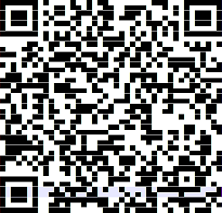

# Nothing to see (Web - 100 pts)

This task is too easy. When we go to the [website](https://59ccbd17af124d37c60a0a246e327ffd.nothing.q.2021.ugractf.ru), we see a certificate warning. Have a look at the certificate and we see the flag: `ugra_v1_p0sm0tr3l1_13ad6d0f281f`

---
# Арбатско-Покровская линия? (Crypto - 150 pts)

We are given a strange cipher with weird symbols, it's not easy to understand them. Time for some cryptanalysis.

What we have here:
- Alphabet is probably `abcdefghijklmnopqrstuvwxy_1234567890`
- Ciphertext consists of 2-digit numbers, with the digits ranging from 1 to 6
- We know that flag format is `ugra_[A-Za-z0-9_]+`, fitting the ciphertext in flag format gives us some interesting correlation:
```
u g r a _ 42 22 15 _ 32 15 46 42 _ 41 42 a 42 23 33 32 _ 23 41 _ 15 41 33 42 15 r 23 13 _ 34 r 33 g r a 31 31 23 32 g _ 65 a 13 62 66 55 61 53 56 12 14 61 62 56 16 14 54 15 12 63 65 13 13 53 55 16 13 61 53 13 61 61 64 16 14 62 65 56 64 64 62 12 65 61 63 61 64 16 a 64 13 16 12 66 61 61 56 54
```
What could possibly be `34 r 33 g r a 31 31 23 32 g`? Searching on [OneLook](https://onelook.com/?w=%3Fr%3Fgra%3F%3F%3F%3Fg&ls=a) gives us `programming`.
```
u g r a _ 42 22 15 _ n 15 46 42 _ 41 42 a 42 i o n _ i 41 _ 15 41 o 42 15 r i 13 _ p r o g r a m m i n g _ 65 a 13 62 66 55 61 53 56 12 14 61 62 56 16 14 54 15 12 63 65 13 13 53 55 16 13 61 53 13 61 61 64 16 14 62 65 56 64 64 62 12 65 61 63 61 64 16 a 64 13 16 12 66 61 61 56 54
```
Let's see what we have so far:
```
43 = u
21 = g
36 = r
11 = a
52 = _
34 = p
33 = o
31 = m
23 = i
32 = n
```
Continue with OneLook a little more and we can guess the rest of the cipher:
```
  1 2 3 4 5 6
1 a b c d e f
2 g h i j k l
3 m n o p q r
4 s t u v w x
5 y _ 1 2 3 4
6 5 6 7 8 9 0
```
From this we decrypt the flag:
`ugra_the_next_station_is_esoteric_programming_9ac60h514bd564fd2eb79cc1hfc51c558fd694886b95758fa8cfb05542`

---
# ЦНИИВТ (Stegano - 150 pts)

Rearrange what we receive from the server in 41x21 matrix and we get a [QR code](qr.txt).



Flag: `ugra_soviet_technologies_are_eternal_ee7c486eb987`

---
# Мощный шифр (Crypto - 250 pts)

We are given a slow [decryption code](decrypt.py), which we have to improve to make it decrypt the ciphertext.

Here's the most important part:

```python
for a, (b, n), (c, d) in zip(
    encrypted_data,
    key["common_key"],
    key["private_key"]
):
    x = (a ** b) ** (c ** d)
    c1 = chr((x % n) % 256)
    c2 = chr((x % n) // 256 % 256)
    c3 = chr((x % n) // 65536)
```
So powerful. This code can be improved using some modular arithmetic properties:
- `x^a = (x % n)^a (mod n)`
- `x^phi(n) = 1 (mod n)`

So the above code can be improved as below:
```python
for a, (b, n), (c, d) in zip(
    encrypted_data,
    key["common_key"],
    key["private_key"]
):
    ab = pow(a, b, n)
    cd = pow(c, d, phi(n))
    x = pow(ab, cd, n)
    c1 = chr((x % n) % 256)
    c2 = chr((x % n) // 256 % 256)
    c3 = chr((x % n) // 65536)
```
(Full code: [decrypt_solve.py](decrypt_solve.py))

Flag: `ugra_it_is_too_powerful_rsa_right_d412d60205d`
